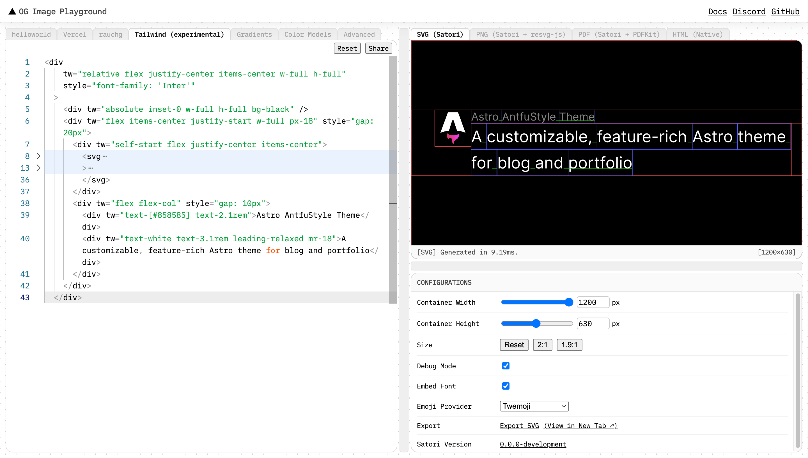

This post is an advanced guide on customizing the [Astro AntfuStyle Theme](https://github.com/lin-stephanie/astro-antfustyle-theme). If you have not yet configured the `src/config.ts` file, it is recommended to first review [Basic Configuration](../basic-configuration/).

## Customizing Logo

**Designing Your Own Logo**

Generate a text-based logo using [Google Font to Svg Path](https://danmarshall.github.io/google-font-to-svg-path/) or create one with AI tools. If proficient, you could use [Adobe Illustrator](https://www.adobe.com/products/illustrator.html) for more professional designs.

Once your logo's SVG file is ready, you'll need to update the `LogoButton` component and the template for the autogenerated OG Images to include your new logo.

**Modifying the LogoButton Component**

Open `src/components/widgets/LogoButton.astro`. This file contains both an ICON SVG and a TEXT SVG, which are currently commented. You can uncomment and switch between them to see different effects.

Replace the existing SVG with your logo’s SVG in this component. Ensure to keep the `aria-hidden="true"` attribute within the `<svg>` tag for accessibility purposes.

If your logo includes black and white, you may need to adjust for theme changes between light and dark modes:

```xml title='logo.svg' "class="dark:fill-[#fff] dark:stroke-[#000]"" "class="dark:filter-invert-100""  wrap
// Method 1: Specify colors for dark mode
<path class="dark:fill-[#fff] dark:stroke-[#000]" fill="#fff" stroke="#000" ...></path>

// Method 2: Use color inversion for dark mode
// (not suitable for non-black and white colors, check before applying!)
<path class="dark:filter-invert-100" ...></path>
```

Further customize your logo through the CSS within the `<style>` section of the component, such as adjusting opacity, scaling, or adding animations. 

The existing grow keyframe animation, applied to the `draw` class, can be modified or removed as needed. For tips on animating SVGs, see [Animated SVG Logo](https://antfu.me/posts/animated-svg-logo).

**Modifying the Autogenerated OG Images Template**

Open the `plugins/og-template/markup.ts` file and replace the SVG section entirely.

You may need to adjust the SVG element's `width`, `height`, and `viewBox` attributes to fit properly. It's recommended to paste the code below into the [Satori - OG Image Playground](https://og-playground.vercel.app/) under the Tailwind (experimental) tab for testing.

```xml
<div
    tw="relative flex justify-center items-center w-full h-full"
    style="font-family: 'Inter'"
  >
    <div tw="absolute inset-0 w-full h-full bg-black" />
    <div tw="flex items-center justify-start w-full px-18" style="gap: 20px">
      <div tw="self-start flex justify-center items-center">
        <!-- Replace Your SVG Logo Here -->
      </div>
      <div tw="flex flex-col" style="gap: 10px">
        <div tw="text-[#858585] text-2.1rem">Astro AntfuStyle Theme</div>
        <div tw="text-white text-3.1rem leading-relaxed mr-18">A customizable, feature-rich Astro theme for blog and portfolio</div>
      </div>
    </div>
  </div>
```

:::image-figure[Make sure to **adjust the parameters** as shown in the image.]

:::

> [!important]- Adjust Black Elements in Your Logo
> 
> Since the [theme’s OG Images](../blog/about-open-graph-images/#template-for-auto-generated-og-images) use a black background, modify any pure black elements in your logo to white for better visibility.

## Replacing the Website Icon

Once you've [customized the logo](#customizing-logo) and have the SVG file, it's time to generate the necessary icons to replace the website's favicon. You'll need to generate the following [Ultimate Favicon Setup](https://evilmartians.com/chronicles/how-to-favicon-in-2021-six-files-that-fit-most-needs#the-ultimate-favicon-setup):

- **`favicon.ico`**: For legacy browsers.
- **`favicon.svg`**: A single SVG icon with light/dark modes for modern browsers.
- **`apple-touch-icon.png`**: A 180×180 PNG for Apple devices.
- **`icon-192.png`**, **`icon-512.png`**, **`icon-mask.png`**: Icons for the web app manifest, including a 192×192 icon for home screens, a 512×512 maskable icon for different Android launchers, and a 512×512 icon for splash screens when the [PWA( Progressive Web App)](https://web.dev/explore/progressive-web-apps) is loading.

> [!note]- Web App Manifest
>
> A web app manifest is a JSON file that helps a browser install your website as an app. It originated from Google's PWA initiative.

First, open the `favicon.svg` file in a text editor. Locate a `<path>` element with a dark or missing fill, and add a CSS media query to adjust the fill color based on the theme:

```xml ins={2-8,10} del={9}
<svg xmlns="http://www.w3.org/2000/svg" viewBox="0 0 500 500">
  <style>
    @media (prefers-color-scheme: dark) {
      .a {
        fill: #f0f0f0;
      }
    }
  </style>
  <path fill="#0f0f0f" d="…"></path>
  <path class="a" fill="#0f0f0f" d="…"></path>
</svg>
```

Next, use the steps in [How to Favicon in 2024](https://evilmartians.com/chronicles/how-to-favicon-in-2021-six-files-that-fit-most-needs#step-2-create-an-ico-file) or [Real Favicon Generator](https://realfavicongenerator.net/) to generate the icons. Rename the files as mentioned above and copy them to the `public` directory to replace the existing ones.

Lastly, update `src/pages/manifest.webmanifest.js` with the following:

```js {5-8,22-23} title='src/pages/manifest.webmanifest.js'
export async function GET() {
  const base = import.meta.env.BASE_URL

  const manifest = {
    name: 'Astro AntfuStyle Theme',
    short_name: 'AntfuStyle',
    description:
      'A customizable, feature-rich Astro theme for blog and portfolio',
    icons: [
      { src: `${base}icon-192.png`, type: 'image/png', sizes: '192x192' },
      { src: `${base}icon-512.png`, type: 'image/png', sizes: '512x512' },
      {
        src: `${base}icon-mask.png`,
        type: 'image/png',
        sizes: '512x512',
        purpose: 'maskable',
      },
    ],
    scope: base,
    start_url: base,
    display: 'standalone',
    theme_color: '#fff',
    background_color: '#fff',
  }

  return new Response(JSON.stringify(manifest), {
    headers: {
      'Content-Type': 'application/manifest+json; charset=utf-8',
    },
  })
}
```

If you don't need PWA support, you can delete `manifest.webmanifest.js`, `icon-192.png`, `icon-512.png`, and `icon-mask.png`.

> [!important]- Handling Icons after Using Real Favicon Generator
>
> If you use Real Favicon Generator, rename `android-chrome-192x192.png` to `icon-192.png` and copy `android-chrome-512x512.png` twice, renaming one to `icon-512.png` and the other to `icon-mask.png`.
>
> Check the `icon-mask.png` with [maskable.app](https://maskable.app/) to ensure it meets the requirements for [maskable icons](https://css-tricks.com/maskable-icons-android-adaptive-icons-for-your-pwa/). It should have bigger paddings around the icon so it can be cropped by the launcher to fit its design. The safe zone is a central circle of 409×409. 

## Customizing Website Styles

While the theme offers some quick [UI configuration options](../basic-configuration/#configuring-ui) in the `src/config.ts`, these are limited. If you're familiar with CSS, you can fully customize the website styles, but it's recommended to follow the methods outlined below.

**Styling approaches**

- Native CSS (in CSS files and component `<style>` tags)
- :link[UnoCSS]{id=@unocss/unocss} utility classes (configured with :link{id=@unocss/preset-uno style=github}, compatible with :link[Tailwind CSS]{id=tailwindlabs/tailwindcss} and :link[Windi CSS]{id=windicss/windicss})
- Custom CSS utility classes (in `unocss.config.ts` under `rules` and `shortcuts`)

**Where styles are defined**

- `styles/main.css`: Global styles.
- `styles/prose.css`: Prose related styles.
- `styles/markdown.css`: Plugin and integration-related styles.
- `src/components/`: Component-specific styles.

:::details
::summary[To modify CSS rulesets in the stylesheets]

For example, adjusting the `max-width` of prose content:

```css title='src/styles/prose.css' {3}
// Original styles, do not modify directly!
.prose {
  max-width: 65ch;
  font-size: 1rem;
  line-height: 1.75;
}
```

```css title='src/styles/your.css' ins={"1":5,8}
// Create a new `.css` file in the `src/styles` directory
// Use the same selector with updated properties
.prose {
  // Write native CSS
  max-width: 70ch;
  
  // Or use UnoCSS utility classes
  --uno: 'max-w-[70ch]'
}
```

```astro title='src/layouts/BaseLayout.astro' ins={"2":6}
import '~/styles/main.css'
import '~/styles/prose.css'
import '~/styles/markdown.css'

// Import your custom file after the others
import '~/styles/your.css'
```

:::

:::details
::summary[To modify specific component styles]

For example, changing the font of group titles on the `/projects` page:

```astro title='src/components/base/Categorizer.astro' ins="custom-class" 
...

<div ...
>
  {
    !wide ? (
      ...
    ) : (
      <span
        // Add a custom class
        class={`custom-class absolute top-0 op-35 dark:op-20 ...`}
      >
        {text}
      </span>
    )
  }
</div>
```

```css title='src/styles/your.css' ins={3-5}
// Create a new `.css` file in the `src/styles` directory
// Write styles using the class selector
.custom-class {
  font-family: 'Gill Sans', 'Gill Sans MT', Calibri, 'Trebuchet MS', sans-serif;
}

```

:::

> [!tip]- Additional Style Modification Tips
> 
> - Avoid modifying the core stylesheets or component `<style>` sections directly for easier updates, as future theme versions may bring changes.
> - Create a new `src/styles/your.css` file and override styles using class selectors.
> - For details on style application precedence in Astro, refer to [Astro - CSS & Styling - Cascading Order](https://docs.astro.build/en/guides/styling/#cascading-order). If your styles don't apply, check for [CSS specificity](https://developer.mozilla.org/en-US/docs/Web/CSS/Specificity) and try using `!important` as needed.


## Customizing Fonts

The theme has configured :link{id=@unocss/preset-web-fonts style=github}. Simply choose a font from [Google Fonts](https://fonts.google.com/) and modify the `fonts` configuration in `unocss.config.ts`:

```ts title='unocss.config.ts' ins={10}
export default defineConfig({
  ...
  presets: [
    ...
    presetWebFonts({
      fonts: {
        sans: 'Inter:400,600,800',
        mono: 'DM Mono:400,600',
        condensed: 'Roboto Condensed',
        customFontName: 'Tilt Neon'
      },
    }),
  ],
  ...
})
```

Modifying the Class Utilities ( font-sans, font-serif, and font-mono) will append new fonts to the existing setup.

By default, UnoCSS fetches fonts from the provider's CDN. To host fonts locally, refer to [UnoCSS - Serve Fonts Locally](https://unocss.dev/presets/web-fonts#serve-fonts-locally).

## Customizing Footer

You can directly modify the `src/components/base/Footer.astro` file. For instance, if you want to apply the [CC BY-NC-SA 4.0](https://creativecommons.org/licenses/by-nc-sa/4.0/) license, you can update the code as follows:

```astro title='src/components/base/Footer.astro' ins={13-20} collapse={1-8,23-34}
---
import Link from '~/components/base/Link.astro'
import { SITE } from '~/config'

const currentYear = new Date().getFullYear()
const copyrightText = `© ${currentYear} ${SITE.author}`
---

<footer class="slide-enter animate-delay-1600! px-7 mt-auto mb-8">
  <div class="prose mx-auto op-50">
    <div class="flex lt-sm:flex-col items-center text-sm whitespace-nowrap">
      <span>
        <Link
          class="op-100! color-[--fg]!"
          href="https://creativecommons.org/licenses/by-nc-sa/4.0/"
          title="CC BY-NC-SA 4.0"
          external={true}
        >
          CC BY-NC-SA 4.0</Link
        >
        {copyrightText}</span
      >
      <span class="lt-sm:hidden">&nbsp;|&nbsp;</span>
      <span>
        Powered by
        <Link
          class="op-100! color-[--fg]!"
          href="https://github.com/lin-stephanie/astro-antfustyle-theme"
          external={true}
        >
          Astro AntfuStyle Theme
        </Link>
      </span>
    </div>
  </div>
</footer>
```

Of course, it would greatly appreciated if you could also keep the `Powered by Astro AntfuStyle Theme` part to help more people discover it. 😊

## Final Cleanup

Finally, you may want to:

- Delete the `.github` directory Remove the `.github` directory (mainly for workflows and templates, but the `scheduled-vercel-deploy.yml` file may be useful for [Customizing GitHub Activity Pages](../customizing-github-activity-pages/#automate-data-refreshing)).
- Clean up `public/og-images/`, `src/content/` and `src/assets/` directories。
- Check `.vscode/settings.json` for adjustments.  
- Rewrite `README.md`.

## Wrapping Up

This is a general overview of what you can customize in the project. If you're proficient with code, there's even more you can personalize!

Next, check out [Authoring Content](../getting-started/#authoring-content) to learn how to tailor each page to your liking.

If you encounter any issues, find errors, or see opportunities for improvement, feel free to join the [discussion](https://github.com/lin-stephanie/astro-antfustyle-theme/discussions) or submit an [issue](https://github.com/lin-stephanie/astro-antfustyle-theme/issues) or [pull request](https://github.com/lin-stephanie/astro-antfustyle-theme/pulls). Your feedback is highly appreciated! ❤️
