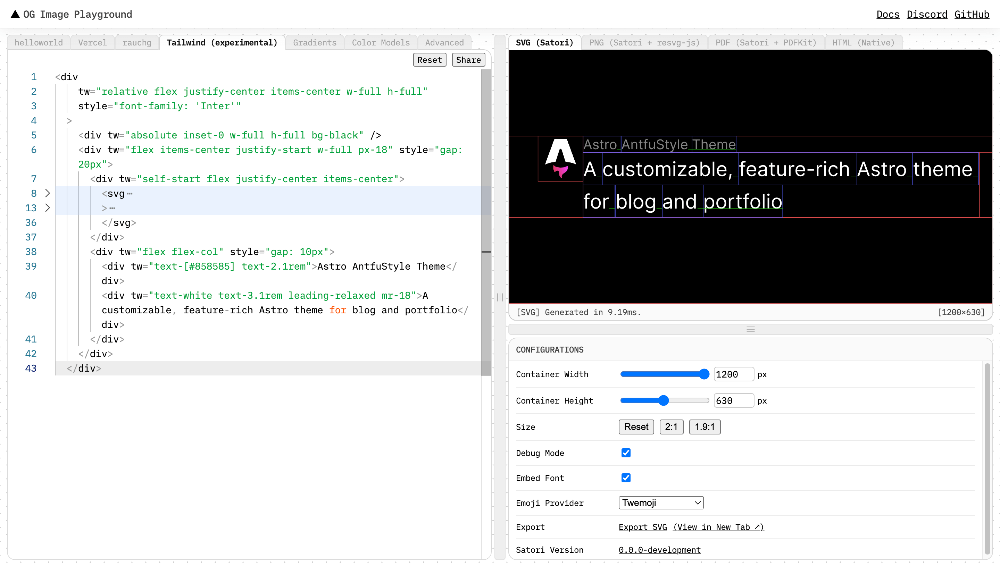

This post is an advanced guide on customizing the [Astro AntfuStyle Theme](https://github.com/lin-stephanie/astro-antfustyle-theme). If you have not yet configured the `src/config.ts` file, it is recommended to first review [Basic Configuration](../basic-configuration/).

## Customizing Logo

**Designing Your Own Logo**

Generate a text-based logo using [Google Font to Svg Path](https://danmarshall.github.io/google-font-to-svg-path/) or create one with AI tools. If proficient, you could use [Adobe Illustrator](https://www.adobe.com/products/illustrator.html) for more professional designs.

Once your logo's SVG file is ready, you'll need to update the `LogoButton` component and the template for the autogenerated OG Images to include your new logo.

**Modifying the LogoButton Component**

Open `src/components/widgets/LogoButton.astro`. This file contains both an ICON SVG and a TEXT SVG, which are currently commented. You can uncomment and switch between them to see different effects.

Replace the existing SVG with your logo’s SVG in this component. Ensure to keep the `aria-hidden="true"` attribute within the `<svg>` tag for accessibility purposes.

If your logo includes black and white, you may need to adjust for theme changes between light and dark modes:

```xml title='logo.svg' "class="dark:fill-[#fff] dark:stroke-[#000]"" "class="dark:filter-invert-100""  wrap
// Method 1: Specify colors for dark mode
<path class="dark:fill-[#fff] dark:stroke-[#000]" fill="#fff" stroke="#000" ...></path>

// Method 2: Use color inversion for dark mode
// (not suitable for non-black and white colors, check before applying!)
<path class="dark:filter-invert-100" ...></path>
```

Further customize your logo using CSS in the `<style>` block or remove it and apply UnoCSS utilities directly—for opacity, scaling, or animations (see [Animated SVG Logo](https://antfu.me/posts/animated-svg-logo)). 

**Modifying the Autogenerated OG Images Template**

Open the `src/utils/og-image/template/markup.ts` file and replace the SVG section entirely.

You may need to adjust the SVG element's `width`, `height`, and `viewBox` attributes to fit properly. It's recommended to paste the code below into the :link[Satori: OG Image Playground]{id=https://og-playground.vercel.app/} under the Tailwind (experimental) tab for testing.

```xml {3}
<div tw="flex items-center justify-start w-full px-18" style="gap: 20px">
  <div tw="self-start flex justify-center items-center">
    <!-- Replace Your SVG Logo Here -->
  </div>
  <div tw="flex flex-col" style="gap: 10px">
    <div tw="text-[#858585] text-2.1rem">${authorOrBrand}</div>
    <div tw="text-white text-3.1rem leading-relaxed mr-18">${title}</div>
  </div>
</div>
```

:::image-figure[Make sure to **adjust the parameters** as shown in the image.]

:::

> [!important]- Adjust black elements in your logo
> 
> Since the [theme’s OG Images](../about-open-graph-images/#template-for-auto-generated-og-images) use dark backgrounds, modify any pure black elements in your logo to white for better visibility.

## Replacing the Website Icon

Once you've [customized the logo](#customizing-logo) and have the SVG file, it's time to generate the necessary icons to replace the website's favicon. You'll need to generate the following :link[Ultimate Favicon Setup]{id=https://evilmartians.com/chronicles/how-to-favicon-in-2021-six-files-that-fit-most-needs#the-ultimate-favicon-setup}:

- **`favicon.ico`**: For legacy browsers.
- **`favicon.svg`**: A single SVG icon with light/dark modes for modern browsers.
- **`apple-touch-icon.png`**: A 180×180 PNG for Apple devices.
- **`icon-192.png`**, **`icon-512.png`**, **`icon-mask.png`**: Icons for the web app manifest, including a 192×192 icon for home screens, a 512×512 maskable icon for different Android launchers, and a 512×512 icon for splash screens when the [PWA (Progressive Web App)](https://web.dev/explore/progressive-web-apps) is loading.

> [!note]- Web App Manifest
>
> A web app manifest is a JSON file that helps a browser install your website as an app. It originated from Google's PWA initiative.

First, open the `favicon.svg` file in a text editor. Add `<style>` to adjust the fill color based on the theme:

```xml {2-7}
<svg xmlns="http://www.w3.org/2000/svg" viewBox="0 0 500 500">
  <style>
    .path { fill: #17191e }
    @media (prefers-color-scheme: dark) {
      .path { fill: #f0f0f0 }
    }
  </style>
  <path d="…"></path>
</svg>
```

> [!tip]- Alternative way to make favicons respond to theme changes
> 
> In the implementation mentioned above, the browser always downloads the same file on initial load. When the user switches the system or browser theme, the browser doesn’t re-parse the SVG, so the favicon only updates after a page refresh or reopening the tab.
>
> For real-time responsiveness, you can store separate files like `favicon-light.svg` and `favicon-dark.svg`, and update `Head.astro` as follows:
> 
> ```astro title='src/components/base/Head.astro' del={4} ins={2-3}
> <!-- Icon -->
> <link rel="icon" type="image/svg+xml" href={withBasePath('/favicon-light.svg')} media="(prefers-color-scheme: light)">
> <link rel="icon" type="image/svg+xml" href={withBasePath('/favicon-dark.svg')}  media="(prefers-color-scheme: dark)">
> <link rel="icon" type="image/svg+xml" href={withBasePath('/favicon.svg')} />
> <link rel="icon" sizes="32x32" href={withBasePath('/favicon.ico')} />
> <link rel="apple-touch-icon" href={withBasePath('/apple-touch-icon.png')} />
> ```
> 
> Note that [Firefox has not yet implemented `link` level media query switching of favicon](https://bugzilla.mozilla.org/show_bug.cgi?id=1603885).

Next, use the steps in :link[How to Favicon in 2024]{id=https://evilmartians.com/chronicles/how-to-favicon-in-2021-six-files-that-fit-most-needs#step-2-create-an-ico-file} or :link[Real Favicon Generator]{id=https://realfavicongenerator.net/} to generate the icons. Rename the files as mentioned above and copy them to the `public` directory to replace the existing ones.

Lastly, update `src/pages/app.webmanifest.js` with the following:

```js {7-10,32-33} title='src/pages/app.webmanifest.js'
import { withBasePath } from '~/utils/path'

export async function GET() {
  // https://developer.mozilla.org/en-US/docs/Web/Progressive_web_apps/Manifest
  const manifest = {
    id: withBasePath('/'),
    name: 'Astro AntfuStyle Theme',
    short_name: 'AntfuStyle',
    description:
      'A customizable, feature-rich Astro theme for blog and portfolio',
    icons: [
      {
        src: withBasePath('icon-192.png'),
        type: 'image/png',
        sizes: '192x192',
      },
      {
        src: withBasePath('icon-512.png'),
        type: 'image/png',
        sizes: '512x512',
      },
      {
        src: withBasePath('icon-mask.png'),
        type: 'image/png',
        sizes: '512x512',
        purpose: 'maskable',
      },
    ],
    scope: withBasePath('/'),
    start_url: withBasePath('/'),
    display: 'standalone',
    theme_color: '#fff',
    background_color: '#fff',
  }

  return new Response(JSON.stringify(manifest), {
    headers: {
      'Content-Type': 'application/manifest+json; charset=utf-8',
    },
  })
}
```

If you don't need PWA support, you can delete `app.webmanifest.js`, `icon-192.png`, `icon-512.png`, and `icon-mask.png`.

> [!important]- Handling icons after using Real Favicon Generator
>
> If you use Real Favicon Generator, rename `android-chrome-192x192.png` to `icon-192.png` and copy `android-chrome-512x512.png` twice, renaming one to `icon-512.png` and the other to `icon-mask.png`.
>
> Check the `icon-mask.png` with [maskable.app](https://maskable.app/) to ensure it meets the requirements for [maskable icons](https://css-tricks.com/maskable-icons-android-adaptive-icons-for-your-pwa/). It should have bigger paddings around the icon so it can be cropped by the launcher to fit its design. The safe zone is a central circle of 409×409. 

## Customizing Website Styles

While the theme offers some quick [UI configuration options](../basic-configuration/#configuring-ui) in the `src/config.ts`, these are limited. If you're familiar with CSS, you can fully customize the website styles, but it's recommended to follow the methods outlined below.

**Styling approaches**

- :link[UnoCSS]{id=unocss/unocss} utility classes using the [Wind3 preset](https://unocss.dev/presets/wind3) (ua compact preset compatible with :link[Tailwind CSS 3]{id=tailwindlabs/tailwindcss} and :link[Windi CSS]{id=windicss/windicss})
- Custom CSS utility classes (in `unocss.config.ts` under `rules` and `shortcuts`)
- Native CSS (in CSS files and component `<style>` tags)

**Where styles are defined**

- `styles/main.css`: Global styles.
- `styles/prose.css`: Prose-related styles.
- `styles/markdown.css`: Plugin- and integration-related styles.
- `src/components/`: Component-specific styles.

:::details
::summary[To modify CSS rulesets in the stylesheets]

For example, adjusting the `max-width` of prose content:

```css title='src/styles/prose.css' {3}
// Original styles, do not modify directly!
.prose {
  max-width: 65ch;
  font-size: 1rem;
  line-height: 1.75;
}
```

```css title='src/styles/your.css' ins={"1":5,8}
// Create a new `.css` file in the `src/styles` directory
// Use the same selector with updated properties
.prose {
  max-width: 70ch;
}
```

```astro title='src/layouts/BaseLayout.astro' ins={"2":6}
import '~/styles/main.css'
import '~/styles/prose.css'
import '~/styles/markdown.css'

// Import your custom file after the others
import '~/styles/your.css'
```

:::

:::details
::summary[To modify specific component styles]

For example, changing the font of group titles on the `/projects` page:

```astro title='src/components/base/Categorizer.astro' ins="custom-class" 
...

<div ...
>
  {
    !wide ? (
      ...
    ) : (
      <span
        // Add a custom class
        class={`custom-class absolute top-0 op-35 dark:op-20 ...`}
      >
        {text}
      </span>
    )
  }
</div>
```

```css title='src/styles/your.css' ins={3-5}
// Create a new `.css` file in the `src/styles` directory
// Write styles using the class selector
.custom-class {
  font-family: 'Gill Sans', 'Gill Sans MT', Calibri, 'Trebuchet MS', sans-serif;
}

```

:::

> [!tip]- Additional style modification tips
> 
> - Avoid modifying the core stylesheets or component `<style>` sections directly for easier updates, as future theme versions may bring changes.
> - Create a new `src/styles/your.css` file and override styles using class selectors.
> - For details on style application precedence in Astro, refer to [Astro - CSS & Styling - Cascading Order](https://docs.astro.build/en/guides/styling/#cascading-order). If your styles don't apply, check for [CSS specificity](https://developer.mozilla.org/en-US/docs/Web/CSS/Specificity) and try using `!important` as needed.


## Customizing Fonts

Before changing font settings, read [Font Setup & Usage](../../shorts/font-setup-and-usage/) for the current font families, where they are used, and how they are loaded.

The theme uses [Astro Fonts](https://docs.astro.build/en/guides/fonts/) as the source of truth. A complete font configuration has three parts:

- Register the font in `astro.config.ts` with `name`, `cssVariable`, provider options, and fallbacks.
- Render that CSS variable with `<Font />` in `src/components/base/Head.astro`.
- Use the variable directly in CSS, or map it to a UnoCSS utility in `unocss.config.ts`.

In the examples below, replace `customFontName` with the real font family name supported by the provider you choose.

To change the font behind an existing variable, keep `cssVariable` unchanged and update that entry in `astro.config.ts`. For example, this replaces the font used by `--font-sans`, so existing `font-sans` utilities and `var(--font-sans)` styles keep working:

```ts title='astro.config.ts' del={13} ins={14}
import { defineConfig, fontProviders } from 'astro/config'

const sansFallbacks = [
  'ui-sans-serif',
  ...
]

export default defineConfig({
  ...
  fonts: [
    {
      provider: fontProviders.fontsource(),
      name: 'Inter',
      name: 'customFontName',
      cssVariable: '--font-sans',
      weights: ['100 900'],
      styles: ['normal'],
      subsets: ['latin'],
      formats: ['woff2'],
      fallbacks: sansFallbacks,
    },
  ],
  ...
})
```

To add a new CSS font variable, add another entry instead:

```ts title='astro.config.ts'
export default defineConfig({
  ...
  fonts: [
    ...
    {
      provider: fontProviders.fontsource(),
      name: 'customFontName',
      cssVariable: '--font-custom',
      weights: [400],
      styles: ['normal'],
      subsets: ['latin'],
      formats: ['woff2'],
      fallbacks: customFallbacks,
    },
  ],
})
```

Then render the new variable in the shared head component:

```astro title='src/components/base/Head.astro' ins={4}
<Font cssVariable="--font-sans" preload />
<Font cssVariable="--font-mono" />
<Font cssVariable="--font-condensed" />
<Font cssVariable="--font-custom" />
```

Only add `preload` to fonts needed for the first visible content; unnecessary preloads can slow down other critical resources.

After that, use it directly in CSS:

```css title='src/styles/your.css'
.custom-heading {
  font-family: var(--font-custom);
}
```

Or map it to a UnoCSS utility:

```ts title='unocss.config.ts'
export default defineConfig({
  ...
  extendTheme: (theme) => {
    return {
      ...theme,
      fontFamily: {
        ...theme.fontFamily,
        sans: 'var(--font-sans)',
        mono: 'var(--font-mono)',
        condensed: 'var(--font-condensed)',
        custom: 'var(--font-custom)',
      },
    }
  },
})
```

```astro
<h2 class="font-custom">Custom font heading</h2>
```

> [!note]- Use matching font fallbacks
>
> Set [`fallbacks`](https://docs.astro.build/en/guides/fonts/#customizing-font-fallbacks) to fonts from the same general family as the main font. Use sans fallbacks for sans-serif fonts, mono fallbacks for code fonts, and serif fallbacks for serif fonts. Quote font family names that contain spaces, and keep a generic family such as `sans-serif`, `monospace`, or `serif` at the end.

> [!important]- Update all references when renaming CSS variables
>
> If you rename an existing CSS variable instead of keeping it, update every place that references it: `src/components/base/Head.astro`, `unocss.config.ts` and direct CSS such as `src/styles/markdown.css`.

## Customizing Footer

You can directly modify the `src/components/base/Footer.astro` file. For instance, if you want to apply the [CC BY-NC-SA 4.0](https://creativecommons.org/licenses/by-nc-sa/4.0/) license, you can update the code as follows:

```astro title='src/components/base/Footer.astro' ins={13-20} collapse={1-8,23-34}
---
import Link from '~/components/base/Link.astro'
import { SITE } from '~/config'

const currentYear = new Date().getFullYear()
const copyrightText = `© ${currentYear} ${SITE.author}`
---

<footer class="slide-enter animate-delay-1600! px-7 mt-auto mb-8">
  <div class="prose mx-auto op-50">
    <div class="flex lt-sm:flex-col items-center text-sm whitespace-nowrap">
      <span>
        <Link
          class="op-100! color-[--fg]!"
          href="https://creativecommons.org/licenses/by-nc-sa/4.0/"
          title="CC BY-NC-SA 4.0"
          external={true}
        >
          CC BY-NC-SA 4.0
        </Link>
        {' '}
        {copyrightText}
      </span>
      <span class="lt-sm:hidden">&nbsp;|&nbsp;</span>
      <span>
        Powered by
        {' '}
        <Link
          class="op-100! color-[--fg]!"
          href="https://github.com/lin-stephanie/astro-antfustyle-theme"
          external={true}
        >
          Astro AntfuStyle Theme
        </Link>
      </span>
    </div>
  </div>
</footer>
```

Of course, it would be greatly appreciated if you could also keep the `Powered by Astro AntfuStyle Theme` part to help more people discover it. 😊

## Configure Giscus Comments

This theme integrates the :link[Giscus]{id=giscus/giscus} comments. By default, users can comment on posts under `blog/` after logging in with GitHub.

Follow the [setup guide](https://giscus.app/) to make your GitHub repo public, install the Giscus app, enable Discussions, and obtain the config needed for the `FEATURES.giscus` option in `src/config.ts`. This is used in `Giscus.astro`. You can also tweak it per the Giscus docs.

For styling, the theme serves custom CSS from `/giscus/light.css` and `/giscus/dark.css`, based on modified styles of the ['noborder_light'](https://github.com/giscus/giscus/blob/main/styles/themes/noborder_light.css) and ['noborder_dark'](https://github.com/giscus/giscus/blob/main/styles/themes/noborder_dark.css) themes. These routes are generated by one dynamic Astro CSS endpoint (`src/pages/giscus/[theme].css.ts`) that injects the self-hosted normal Inter `@font-face` rule generated by Astro Fonts.

Because Giscus runs inside an iframe, it cannot inherit the parent page's CSS variables or `@font-face` rules. To allow `https://giscus.app` to load the theme CSS and font files, the local dev server and the production host both need to allow that cross-origin request:

- **Development**: The theme already configures two settings in `astro.config.ts`: `security.allowedDomains` lets Astro's dev request filter accept `https://giscus.app`, and `vite.server.headers` adds the CORS response header that lets the Giscus iframe load `/giscus/*.css` and `/_astro/fonts/*` locally:

```ts title='astro.config.ts'
export default defineConfig({
  ...
  security: {
    allowedDomains: [
      {
        hostname: 'giscus.app',
        protocol: 'https',
      },
    ],
  },
  vite: {
    server: {
      headers: {
        'Access-Control-Allow-Origin': 'https://giscus.app',
      },
    },
  },
})
```

- **Production**: Ensure your host serves both the custom CSS and Astro font files with proper CORS headers. If you're on Vercel, the theme's `vercel.json` already includes this setup. But if you use another platform, you’ll need to manually configure it. For example, on Netlify, create a `_headers` file:

```txt title='_headers'
/giscus/*
  Access-Control-Allow-Origin: https://giscus.app
/_astro/fonts/*
  Access-Control-Allow-Origin: https://giscus.app
```

If you prefer to use Giscus's built-in themes directly, update `Giscus.astro`, `ThemeSwitch.astro`, and `astro.config.ts` as shown below, and remove the unused `[theme].css.ts` endpoints, `src/styles/giscus/`, and related CORS config.

```astro title='src/components/widgets/Giscus.astro' del={4-5} ins={6-7}
<script>
  import { FEATURES } from '~/config'

  const giscusThemeLight = withClientBasePath('giscus/light.css')
  const giscusThemeDark = withClientBasePath('giscus/dark.css')
  const giscusThemeLight = 'noborder_light'
  const giscusThemeDark = 'noborder_dark'
  ...
</script>
```

```astro title='src/components/widgets/ThemeSwitch.astro' del={4-5} ins={6-7}
<script>
  const changeGiscusTheme = (isDark: boolean) => {
    const newTheme = isDark
      ? withClientBasePath('giscus/dark.css')
      : withClientBasePath('giscus/light.css')
      ? 'noborder_dark'
      : 'noborder_light'
    ...
  }
</script>
```

> [!note]- How to enable or disable Giscus
> To disable Giscus globally, set `FEATURES.giscus` to `false` in `src/config.ts`.
> 
> To disable it for a specific post, set `giscus: false` in the post’s frontmatter.
> 
> You can also control it via the `isCommentable` prop (default `false`) when using `RenderPost.astro`.

> [!tip]- Restricting allowed domains for Giscus
> To limit which domains can load Giscus with your repo’s discussions, create a `giscus.json` file in the project root and configure it as shown [here](https://github.com/giscus/giscus/blob/main/ADVANCED-USAGE.md#giscusjson).

## Final Cleanup

Finally, you may want to:

- Remove the `.github` directory (mainly for workflows and templates, but the `scheduled-vercel-deploy.yml` file may be useful for [Customizing GitHub Activity Pages](../customizing-github-activity-pages/#automate-data-refreshing)).
- Clean up the `src/content/`, `src/assets/`, and other directories.
- Review `.vscode/settings.json` for adjustments.  
- Rewrite `README.md`.
- Delete anything you don’t need and know is safe.

## Wrapping Up

This is a general overview of what you can customize in the project. If you're proficient with code, there's even more you can personalize!

Next, check out [Authoring Content](../getting-started/#authoring-content) to learn how to tailor each page to your liking.

If you encounter any issues, find errors, or see opportunities for improvement, feel free to join the [discussion](https://github.com/lin-stephanie/astro-antfustyle-theme/discussions) or submit an [issue](https://github.com/lin-stephanie/astro-antfustyle-theme/issues) or [pull request](https://github.com/lin-stephanie/astro-antfustyle-theme/pulls). Your feedback is highly appreciated! ❤️

:::details
::summary[Changelog]
2025-05-20
- Add [Configure Giscus Comments](#configure-giscus-comments)

2025-07-16
- Add an alternative way to make favicons respond to theme changes

2026-07-07
- Update Customizing Fonts, Customizing Footer, and Configure Giscus Comments

[View full history](https://github.com/lin-stephanie/astro-antfustyle-theme/commits/main/src/content/blog/advanced-configuration.md)
:::
