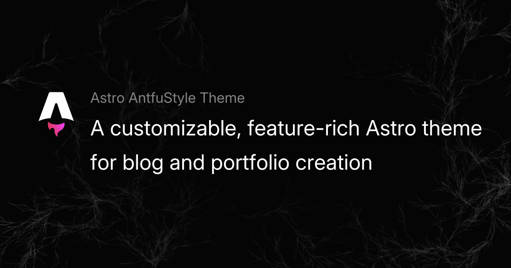

This post provides a brief guide on how to organize and use images in the [Astro AntfuStyle Theme](https://github.com/lin-stephanie/astro-antfustyle-theme).

## Supported Cases for Image Optimization and Responsive Processing

Astro supports optimizing images and generating responsive images via the [Image Service API](https://docs.astro.build/en/reference/image-service-reference/) (:link[sharp]{id=lovell/sharp .github} is the [default service](https://docs.astro.build/en/guides/images/#default-image-service)). This enables optimizations such as converting to WebP, compressing, adding attributes, inferring dimensions to prevent CLS, lazy loading and async decoding. With responsive image properties, [Astro internally automatically generate the required `srcset` and `sizes` values for your images](https://docs.astro.build/en/guides/images/#responsive-image-behavior). These optimizations apply in the following cases:

- [Local images stored in `src/`](https://docs.astro.build/en/guides/images/#where-to-store-images) (Images in `public/` are not processed.)
- [**Authorized** remote images](https://docs.astro.build/en/guides/images/#authorizing-remote-images) (including those used with ``, `<Image />`, `<Picture />` and `getImage()`)

## Images in Markdown Files

It is recommended to store the local images used in the post under the `src/assets/` directory, and create a subdirectory based on the post’s filename (e.g., images for `src/content/blog/your-post-file-name.md` stored in `src/assets/your-post-file-name/`), which will allow them to be optimized during Astro’s build process and make it easier to organize and maintain (this strategy can also apply to other static resources).

```md title='src/content/blog/post-name.md'
<!-- Local images (`src/assets/`) -->
<!-- Use a relative path or the import alias -->
<!-- Astro optimizes these files: hashed names → `dist/_astro/` -->




<!-- Public images (`public/`) -->
<!-- Use the file path relative to `public/` -->
<!-- Served as-is; Astro does NOT optimize -->


<!-- Remote images -->
<!-- Full URL with `` or `` tag -->
<!-- Authorized remote images with `` will be optimized -->
<!-- Authorized remote images with `` will not be optimized -->


<!-- ❌ Invalid examples -->


<Image src="../../assets/about-open-graph-images/plum.png" alt="Local image" />
<Image src="https://example.com/remote-image.png" alt="Remote image" />
```

> [!tip]- Adjusting image attributes in Markdown/MDX
>
> To modify attributes of an `img` element (like size) in Markdown/MDX, use the :link[remark-imgattr]{id=OliverSpeir/remark-imgattr .github} syntax.
> 
> **Note**: Styles must be written directly in the `style` attribute or by applying a `class`. UnoCSS utility classes won't apply.


## Images in MDX Files

In addition to supporting the standard Markdown `` syntax as demonstrated above, you can also use Astro’s `<Image />` component and JSX `` tags in your `.mdx` files by importing both the component and your image.

```mdx title='src/content/blog/post-name.mdx'
# MDX Post

---
title: My Page title
---

import { Image } from 'astro:assets';
import plum from '../assets/about-open-graph-images/plum.png';

{/* Local image stored in the the same folder */}


{/* Local image stored in `src/assets/` */}

<Image src={plum} alt="A rocketship in space." />


{/* Image stored in `public/` */}


<Image src="/og-images/og-image.png" alt="Public image" width='1200' height='630'/>

{/* Remote image on another server */}


<Image src="https://example.com/remote-image.png" infersize />
```

## Image Compression

As mentioned, Astro can compress images from the `src/` folder. However, for images in blog posts, especially those in `public`, it’s recommended to manually compress them to avoid performance issues. Useful tools include :link[Tinify]{id=https://tinify.com/web}, :link[Squoosh]{id=https://squoosh.app/}, and :link[SVGO]{id=https://svgo.dev/}.

## Wrapping Up

I hope this post helps clarify image usage in Markdown/MDX within this theme. For anything not covered here, check out the [Astro Images Docs](https://docs.astro.build/en/guides/images/) . 📖

:::details
::summary[Changelog]
2025-04-30
- Changes for Astro 5.7

2025-07-16
- Update: [Supported Cases for Image Optimization and Responsive Processing](#supported-cases-for-image-optimization-and-responsive-processing)

[View full history](https://github.com/lin-stephanie/astro-antfustyle-theme/commits/main/src/content/blog/managing-image-assets.md)
:::
