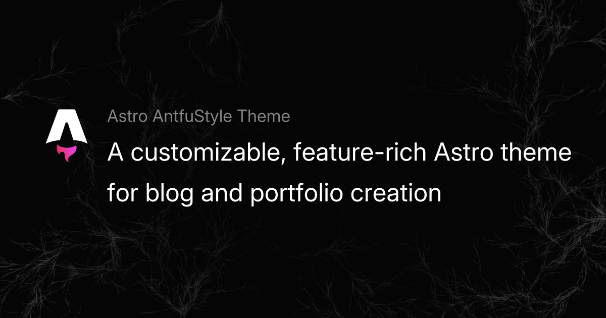

This post introduces some handy tricks for using special syntax in the [Astro AntfuStyle Theme](https://github.com/lin-stephanie/astro-antfustyle-theme) to enhance your Markdown/Mdx content. These shortcuts let the theme’s built-in integrations or plugins handle the heavy lifting, automatically converting everything into HTML --- _no need to write complex code yourself!_ 🎨

## Callouts (Alerts / Admonitions)

Supported by :link[rehype-callouts]{id=lin-stephanie/rehype-callouts style='github'}, you can modify [the plugin's configuration](https://github.com/lin-stephanie/rehype-callouts?tab=readme-ov-file#options-useroptions) in `plugins/index.ts`. 

If you change the `theme` configuration (default: `'vitepress'`), you will also need to update the imported CSS file in `src/styles/markdown.css` (`@import 'rehype-callouts/theme/yourconfig'`).

```md wrap

<!-- Callout type names are case-insensitive: 'Note', 'NOTE', and 'note' are equivalent. -->

<!-- With 'vitepress' theme, you can use the following callout types: -->

> [!note]
> Highlights information that users should take into account, even when skimming.

> [!TIP] You can customize the `title`！ 
> Optional information to help a user be more successful.

> [!Important]- This is a **collapsible** callout, **initially close**.
> Crucial information necessary for users to succeed.

> [!Warning]+ This is a _collapsible and nested_ callout, _initially open_.
>
> Critical content demanding immediate user attention due to potential risks.
> 
> > [!caution]- This is a **collapsible** callout, too
> > Negative potential consequences of an action.
```

> [!note]
> Highlights information that users should take into account, even when skimming.

> [!TIP] You can customize the `title`！
> Optional information to help a user be more successful.

> [!Important]- This is a **collapsible** callout, **initially close**.
> Crucial information necessary for users to succeed.

> [!Warning]+ This is a _collapsible and nested_ callout, _initially open_.
>
> Critical content demanding immediate user attention due to potential risks.
> 
> > [!caution]- This is also a **collapsible** callout.
> > Negative potential consequences of an action.

## Fully-featured Code Blocks

Supported by :link[astro-expressive-code]{link=https://github.com/expressive-code/expressive-code/tree/main/packages/astro-expressive-code imageUrl='https://avatars.githubusercontent.com/u/124694388'} with [@expressive-code/plugin-collapsible-sections](https://expressive-code.com/plugins/collapsible-sections/) and [@expressive-code/plugin-line-numbers](https://expressive-code.com/plugins/line-numbers/) plugins to add styling and extra functionality for code blocks. 

To customize code block themes or functionality, modify the `ec.config.mjs` file at the project root after reviewing the [Configuring Expressive Code](https://expressive-code.com/reference/configuration/), such as [change themes](https://expressive-code.com/guides/themes/#using-bundled-themes), [enable word wrap](https://expressive-code.com/key-features/word-wrap/#wrap), or [toggle line numbers](https://expressive-code.com/plugins/line-numbers/#showlinenumbers).

Here’s a quick preview of what’s possible. Check the [detailed guide](https://expressive-code.com/key-features/syntax-highlighting/) for more info.

##### Syntax Highlighting

```js title='example.md'
console.log('This code is syntax highlighted!')
```

```ansi title='ansi-example.md'
ANSI colors:
- Regular: Red Green Yellow Blue Magenta Cyan
- Bold:    Red Green Yellow Blue Magenta Cyan
- Dimmed:  Red Green Yellow Blue Magenta Cyan

256 colors (showing colors 160-177):
160 161 162 163 164 165
166 167 168 169 170 171
172 173 174 175 176 177

Full RGB colors:
ForestGreen - RGB(34, 139, 34)

Text formatting: Bold Dimmed Italic Underline
```

##### Code editor frames

```js title="my-test-file.js"
// Use `title="my-test-file.js"`
console.log('Title attribute example')
```

```ts
// src/content/index.ts
// Use `// src/content/index.ts`
console.log('File name comment example')
```

##### Terminal frames

```bash
echo "This terminal frame has no title"
```

```powershell title="PowerShell terminal example"
Write-Output "This one has a title!"
```

##### Marking full lines & line ranges

```js {1, 4, 7-8}
// Line 1 - targeted by line number
// Line 2
// Line 3
// Line 4 - targeted by line number
// Line 5
// Line 6
// Line 7 - targeted by range "7-8"
// Line 8 - targeted by range "7-8"
```

##### Selecting line marker types (mark, ins, del)

```js title="line-markers.js" del={2} ins={3-4} {6}
function demo() {
  console.log('this line is marked as deleted')
  // This line and the next one are marked as inserted
  console.log('this is the second inserted line')

  return 'this line uses the neutral default marker type'
}
```

##### Adding labels to line markers

```jsx {"1":5} del={"2":7-8} ins={"3":10-12}
// labeled-line-markers.jsx
<button
  role="button"
  {...props}
  value={value}
  className={buttonClassName}
  disabled={disabled}
  active={active}
>
  {children &&
    !active &&
    (typeof children === 'string' ? <span>{children}</span> : children)}
</button>
```

##### Adding long labels on their own lines

```jsx {"1. Provide the value prop here:":5-6} del={"2. Remove the disabled and active states:":8-10} ins={"3. Add this to render the children inside the button:":12-15}
// labeled-line-markers.jsx
<button
  role="button"
  {...props}

  value={value}
  className={buttonClassName}

  disabled={disabled}
  active={active}
>

  {children &&
    !active &&
    (typeof children === 'string' ? <span>{children}</span> : children)}
</button>
```

##### Using diff-like syntax

```diff
+this line will be marked as inserted
-this line will be marked as deleted
this is a regular line
```

```diff lang="js"
  function thisIsJavaScript() {
    // This entire block gets highlighted as JavaScript,
    // and we can still add diff markers to it!
-   console.log('Old code to be removed')
+   console.log('New and shiny code!')
  }
```

##### Marking individual text inside lines

```js "given text"
// Plaintext search strings
function demo() {
  // Mark any given text inside lines
  return 'Multiple matches of the given text are supported'
}
```

##### Marking individual text inside lines

```ts /ye[sp]/
// Regular expressions
console.log('The words yes and yep will be marked.')
```

```sh /\/ho.*\//
# Regular expressions
echo "Test" > /home/test.txt
```

```ts /ye(s|p)/
// Regular expressions
If you only want to mark certain parts matched by your regular expression, you can use capture groups. 

For example, the expression `/ye(s|p)/` will match yes and yep, but only mark the character s or p:
```

```ts /ye(?:s|p)/
// Regular expressions
To prevent this special treatment of capture groups, you can convert them to non-capturing groups by adding ?: after the opening parenthesis. For example:

This block uses `/ye(?:s|p)/`, which causes the full
matching words "yes" and "yep" to be marked.
```

```js "return true;" ins="inserted" del="deleted"
// Selecting inline marker types (mark, ins, del)
function demo() {
  console.log('These are inserted and deleted marker types');
  // The return statement uses the default marker type
  return true;
}
```

##### Configuring word wrap per block

```js wrap
// Example with wrap
function getLongString() {
  return 'This is a very long string that will most probably not fit into the available space unless the container is extremely wide'
}
```

```js wrap=false
// Example with wrap=false
function getLongString() {
  return 'This is a very long string that will most probably not fit into the available space unless the container is extremely wide'
}
```

##### Configuring indentation of wrapped lines

```js wrap preserveIndent
// Example with preserveIndent (enabled by default)
function getLongString() {
  return 'This is a very long string that will most probably not fit into the available space unless the container is extremely wide'
}
```

```js wrap preserveIndent=false
// Example with preserveIndent=false
function getLongString() {
  return 'This is a very long string that will most probably not fit into the available space unless the container is extremely wide'
}
```

##### Collapsible sections

```js collapse={1-5, 12-14, 21-24}
// All this boilerplate setup code will be collapsed
import { someBoilerplateEngine } from '@example/some-boilerplate'
import { evenMoreBoilerplate } from '@example/even-more-boilerplate'

const engine = someBoilerplateEngine(evenMoreBoilerplate())

// This part of the code will be visible by default
engine.doSomething(1, 2, 3, calcFn)

function calcFn() {
  // You can have multiple collapsed sections
  const a = 1
  const b = 2
  const c = a + b

  // This will remain visible
  console.log(`Calculation result: ${a} + ${b} = ${c}`)
  return c
}

// All this code until the end of the block will be collapsed again
engine.closeConnection()
engine.freeMemory()
engine.shutdown({ reason: 'End of example boilerplate code' })
```

##### Displaying line numbers per block

```js showLineNumbers
// This code block will show line numbers
console.log('Greetings from line 2!')
console.log('I am on line 3')
```

```js showLineNumbers=false
// Line numbers are disabled for this block
console.log('Hello?')
console.log('Sorry, do you know what line I am on?')
```

```js showLineNumbers startLineNumber=5
// Changing the starting line number
console.log('Greetings from line 5!')
console.log('I am on line 6')
```

## Image Caption & Link 

Build on :link[remark-directive]{id=remark/remark-directive style='github'} with a custom `remark-image-container` plugin (located in `plugins/remark-image-container.ts`) to quickly add image captions，links and more.

> [!tip]
>
> You can refer to the [Remark Directive Syntax](https://github.com/micromark/micromark-extension-directive?tab=readme-ov-file#syntax) for a quick overview of its basic rules --- it’s easy to understand and remember!

### `:::image-figure`

The custom directive creates a block with an image, figcaption, and optional styling, much like a figure in academic papers.

`:::image-figure[caption]{figcaption attrs}`: The square brackets hold the figcaption (if not set, the alt text from `` will be used as the default), and curly braces are for inline styles or supported attributes.

`(img attrs)`: Standard Markdown image syntax with optional attributes inside parentheses (powered by :link[remark-imgattr]{#OliverSpeir/remark-imgattr style=github}, allowing customization of attributes for the generated `` elements).

```md title=':::image-figure.md'
:::image-figure[This Is a **Figcaption** with _`<figure>` Attrs_]{style="text-align:center;color:orange"}

:::

:::image-figure[This is a **figcaption** with _`` attrs_.]
(style: width:600px;)
:::

<!-- 💡 Use `(class:no-zoom)` to disable zoom -->
:::image-figure[This is a **figcaption** with `class:no-zoom`.]
(class:no-zoom)
:::

<!-- 💡 If no `[caption]`, use alt text as figcaption. -->
:::image-figure
![If `[caption]` not set, the alt text from `` will be used as the figcaption.](~/assets/markdown-mdx-extended-featurs/og-image.png)
:::

<!-- 💡 Images for light (img-light) and dark (img-dark) modes -->
<!-- ⚠️ At least one line must separate two image syntaxes (), or won't work. -->
:::image-figure[This example shows different images for light (add `class:img-light`) and dark (add `class:img-dark`) modes.]
(class:img-light)

(class:img-dark)
:::

<!-- ❌ If no text is available for the figcaption, it won't work.  -->
:::image-figure

:::
```

:::image-figure[This Is a **Figcaption** with _`<figure>` Attrs_]{style="text-align:center;color:orange"}

:::

:::image-figure[This is a **figcaption** with _`` attrs_.]
(style: width:600px;)
:::

:::image-figure[This is a **figcaption** with `class:no-zoom`.]
(class:no-zoom)
:::

:::image-figure
![If `[caption]` not set, the alt text from `` will be used as the figcaption.](~/assets/markdown-mdx-extended-featurs/og-image.png)
:::

:::image-figure[This example shows different images for light (add `class:img-light`) and dark (add `class:img-dark`) modes.]
(class:img-light)

(class:img-dark)
:::

> [!warning] 
> 
> Setting an image's `width` attribute directly may cause blurriness. [Learn more](https://github.com/lin-stephanie/astro-antfustyle-theme/discussions/17)

### `:::image-a`

The custom directive wraps an image inside a link, making it clickable.

`:::image-a{<a> attrs}`: Define the link (href), styles, or classes in the curly braces for `<a>` element.

`( attrs)`: Same as above.

```md title=':::image-a.md'
:::image-a{href="https://github.com/lin-stephanie/astro-antfustyle-theme"}

:::

:::image-a{href="https://github.com/lin-stephanie/astro-antfustyle-theme" style="display:block" .custom-class}
(style: margin-bottom: -1rem; transform:scaleX(1.1) scaleY(1.1);, loading: eager)
:::

::::image-a{href="https://github.com/lin-stephanie/astro-antfustyle-theme"}
:::image-figure[This example shows `:::image-a` wraps around `:::image-figure` (both are interchangeable).]

:::
::::

<!-- ❌ No external links provided, it won't work.-->
:::image-a

:::
```

:::image-a{href="https://github.com/lin-stephanie/astro-antfustyle-theme"}

:::

:::image-a{href="https://github.com/lin-stephanie/astro-antfustyle-theme" style="display:block" .custom-class}
(style: margin-bottom: -1rem; transform:scaleX(1.1) scaleY(1.1);, loading: eager)
:::

::::image-a{href="https://github.com/lin-stephanie/astro-antfustyle-theme"}
:::image-figure[This example shows `:::image-a` wraps around `:::image-figure` (both are interchangeable).]

:::
::::

## Video Embedding（`::video`）

Similarly, this theme includes predefined directives through a custom `remark-sugar-directive` plugin (located in `plugins/remark-sugar-directive.ts`), enabling quick implementation of features like video embedding, styled GitHub links, badges and details dropdown as described below.

The custom `::video` directive allows for consistent video embedding across different platforms, with flexible options for configuration.

`::video{<youtubeId|bilibiliId|vimeoId> <noScale> <iframeSrc>}`: Curly braces contain the platform-specific video ID, along with optional parameters.

```md title='::video.md'
::video{youtubeId=gxBkghlglTg}

::video{bilibiliId=BV1MC4y1c7Kv}

<!-- Setting `noScale=true` disables video scaling -->
::video{vimeoId=912831806 noScale=true}

<!-- You can directly provide the iframe URL for embedding a video via `iframeSrc` -->
::video{iframeSrc='https://www.youtube-nocookie.com/embed/gxBkghlglTg'}
```

::video{youtubeId=gxBkghlglTg}

::video{bilibiliId=BV1MC4y1c7Kv}

<!-- Setting `noScale=true` disables video scaling -->
::video{youtubeId=gxBkghlglTg noScale=true}

<!-- You can directly provide the iframe URL for embedding a video via `iframeSrc` -->
::video{iframeSrc='https://www.youtube-nocookie.com/embed/gxBkghlglTg'}

## Styled GitHub Link（`:link`）

The custom `:link` directive simplifies the process of creating styled links to GitHub repositories, users/organizations, or any external URLs with streamlined syntax.

**Basic Syntax**

Use `:link` with display text in square brackets and `id` parameter (or shorthand with a `#` prefix) in curly braces.  

**Example 1**: `:link[Astro]{#withastro/astro}` or `:link[Astro]{id=withastro/astro}` creates a link to :link[Astro]{#withastro/astro} repo.

**Example 2**: `:link[Stephanie Lin]{#@lin-stephanie}` links to the GitHub profile of the project maintainer, :link[Stephanie Lin]{#@lin-stephanie}.

**Example 3**: `:link[Vite]{id=@vitejs}` links to the GitHub profile of the :link[Vite]{id=@vitejs} organization.

> [!important]
> When linking to a GitHub user or organization, you must prepend the `id` with `@`.
> 
> If the `[]` part is omitted, the link will display the text of the `id` parameter by default.

**Specific Subsections**

The `:link` directive also supports linking to specific sections within a GitHub user or organization using the `tab` parameter.

**Example 4**: `:link{#@lin-stephanie tab=repositories}` links directly to the repositories tab of the GitHub user, like :link{#@lin-stephanie tab=repositories}. For GitHub users, valid `tab` options: `'repositories','projects', 'packages', 'stars', 'sponsoring', 'sponsors'`.

**Example 5**: `:link{#@vitejs tab=org-people}` links directly to the people section of a GitHub organization, like :link{#@vitejs tab=org-people} For GitHub organizations, valid `tab` options: `'org-repositories', 'org-projects', 'org-packages', 'org-sponsoring', and 'org-people'`.

**External URLs**

When you want to link to something other than a GitHub resource, use the `link` parameter to customize external links. This parameter is required if no `id` is specified.

**Example 6**: `:link[Google]{link=https://www.google.com/}` creates an external link to the :link[Google]{link=https://www.google.com/}.

**Icon and Style Customization**

You can customize icons with the `imageUrl` parameter or adjust button styles using the `style`parameter (optional values: `'square', 'rounded', 'github'`).

**Example 7**: `:link[Astro]{#withastro/astro style=rounded}` creates a rounded button like :link[Astro]{#withastro/astro style='rounded'}.

**Example 8**: `:link[Vite]{id=@vitejs style=square}` creates a square button like :link[Vite]{id=@vitejs style=square}.

**Example 9**: `:link{#lin-stephanie/astro-antfustyle-theme style=github}` creates a GitHub-styled link like:

:link{#lin-stephanie/astro-antfustyle-theme style=github}

**Example 10**: `:link[send a little encouragement my way ❤️]{link=https://github.com/sponsors/lin-stephanie imageUrl=https://github.githubassets.com/assets/mona-e50f14d05e4b.png}` fully customizes a link.

Thanks for making it this far! Writing is no easy task --- maybe you'd like to  :link[send a little encouragement my way ❤️]{link=https://github.com/sponsors/lin-stephanie imageUrl=https://github.githubassets.com/assets/mona-e50f14d05e4b.png}.


## Badges（`:badge`）

The `:badge` directive allows you to add customizable markers to improve document visuals.

There are built-in markers that automatically apply predefined labels and colors based on the configuration:

- `badge-a`: :badge-a
- `badge-v`: :badge-v
- `badge-o`: :badge-o
- `badge-f`: :badge-f
- `badge-t`: :badge-t
- `badge-w`: :badge-w
- `badge-g`: :badge-g

You can find and redefine these configurations in `plugins/remark-sugar-directive.ts`.

Additionally, you can use `:badge[Text]{<color>}` for easy visual customization of badges. For example: `:badge[ISSUE]{color=#aaf233}` will display as :badge[ISSUE]{color=#aaf233}. If no color is specified, the default appearance will look like :badge[This].


## Details Dropdown

```md title=':::details.md'
:::details
::summary[Details Dropdown]
- List item 1
- List item 2
- List item 3
- List item 4
:::
```

:::details
::summary[Details Dropdown]
- List item 1
- List item 2
- List item 3
- List item 4
:::

Additionally, it also supports usage similar to the [examples in remark-directive](https://github.com/remarkjs/remark-directive?tab=readme-ov-file#use).

## Wrapping Up

With the features above, the theme streamlines your Markdown/MDX content creation without requiring you to dive into complex HTML or CSS. Just focus on your ideas and let the theme handle the rest!

If you're feeling adventurous, consider defining your own custom "directive syntax sugar" to tailor the experience even further! Contributions are always welcome --- feel free to join the [discussion](https://github.com/lin-stephanie/astro-antfustyle-theme/discussions) or submit an [issue](https://github.com/lin-stephanie/astro-antfustyle-theme/issues) or [pull request](https://github.com/lin-stephanie/astro-antfustyle-theme/pulls).

Thanks for checking out the theme. Have fun and enjoy creating! ⚡️
