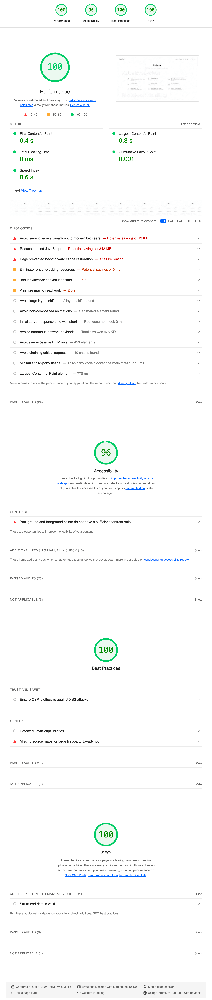

:::details
::summary[Testing the `/projects` page with the `'dot'` background results in:]

:::

The accessibility score is not perfect due to "Background and foreground colors do not have a sufficient contrast ratio", which is a result of the theme's styling. If you don’t mind this, the theme performs very well in Lighthouse. A high-contrast version is planned.

You can also check the live demo’s performance on :link[PageSpeed Insights]{id=https://pagespeed.web.dev/}
